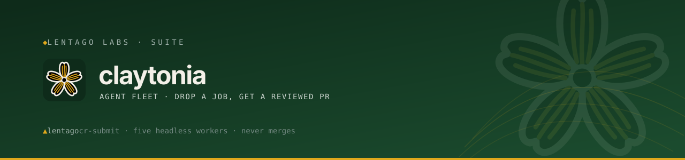

<!-- Lentago Labs brand header — generated by lentago/.github → brand/generate.py.
     Regenerate there; do not hand-edit the banner or badge URLs. -->
<a href="https://lentago.dev"></a>

[](https://github.com/lentago/claytonia/actions) [](https://github.com/lentago/claytonia/blob/main/LICENSE) [](https://deepwiki.com/lentago/claytonia)

   

# claytonia

**Claytonia** (spring beauty — the botanical codename line alongside `lentago`,
`solidago`, `kalmia`, and `drosera`) is the Lentago Labs agent-fleet
orchestration system: a self-hosted **fleet of headless coding agents** on the
LAN. Drop a job onto the NAS, an idle worker picks it up, does the work in a
clean checkout, and opens a PR for human review. Scheduled (cron) + triggered
(drop-folder) jobs, per-project context, GitHub App auth, per-job metrics to
Grafana, crash-safe at-least-once delivery. Today's workers run Claude Code;
platform-agnostic worker support (other agent CLIs behind the same queue) is
the next scope expansion.

This repo is also an exhibit. Lentago Labs is a shared learning lab for
IT-operations people: the estate is real (a Proxmox homelab and a
production-grade AWS platform), the stakes are deliberately non-critical, and
everything is code. claytonia is the corner of that estate where a **fleet of
agents does directed work and every merge is still a human's call** — a live,
small-scale place to see everything-as-code and agent-ops fit together, then
change something yourself.

**Authorship:** The queue scripts, worker tooling, and documentation in this
repo are co-written with [Claude](https://claude.ai) (Anthropic). I direct the
work and review the output; Claude writes the code. I'm an infrastructure
operator, not a software engineer — please don't read this repo as a portfolio
of coding ability.

The fleet keeps its nickname, **the bullpen**: a pool of ready workers called up
when needed. Agents idle until a job arrives, then one gets the call. The
on-host layer keeps the name too (`/opt/bullpen`, `bullpen-gitops.*`,
`BULLPEN_*` env vars) — renamed from `bullpen` on 2026-07-04, live paths and
unit names deliberately unchanged.

## 📚 Ask this codebase (DeepWiki)

<a href="https://deepwiki.com/lentago/claytonia"></a>

> [DeepWiki](https://deepwiki.com/lentago/claytonia) maintains an AI-generated wiki over this
> repository — architecture pages, diagrams, and a Q&A box grounded in the actual code. Every
> public Lentago Labs repo is indexed ([deepwiki.com/lentago](https://deepwiki.com/lentago));
> it is the fastest way to orient before reading source. It is AI-generated: trust it to orient
> you, verify against the code before you act on it.

**Good first questions:**

- How does a worker atomically claim a job from the NAS inbox without two workers double-processing it?
- What is the relationship between claytonia's Terraform root and kalmia's guest layer — which one owns which Proxmox guests?
- How does the gitops deploy loop on each worker validate a pulled change before restarting units, and what happens if validation fails?

## 🧭 What this repo demonstrates

Operations patterns you can inspect end to end here — each row links to the code that proves it.

| Pattern | How it shows up here |
| --- | --- |
| **Apply-on-merge Terraform for guest lifecycle** — change management where the merged PR *is* the change record | [`terraform.yml`](https://github.com/lentago/claytonia/blob/main/.github/workflows/terraform.yml) runs `terraform plan` on the PR and `terraform apply -auto-approve` on merge to `main`, serialized by a concurrency group so simultaneous merges can't race on state |
| **Self-hosted LAN runner for a LAN-only API** | terraform CI is pinned to [`runs-on: [self-hosted, lan]`](https://github.com/lentago/claytonia/blob/main/.github/workflows/terraform.yml) (LXC 115) because the Proxmox API isn't reachable from GitHub-hosted runners |
| **Least-privilege identity per system** | [`id-token: write`](https://github.com/lentago/claytonia/blob/main/.github/workflows/terraform.yml) → an AWS role for the S3 tfstate backend (OIDC, no static keys); on-prem a dedicated `claytonia-tf@pve` token scoped to one PVE resource pool ([terraform/README.md](https://github.com/lentago/claytonia/blob/main/terraform/README.md)) |
| **Pull-based GitOps self-deploy on the workers** | [`bullpen-gitops.sh`](https://github.com/lentago/claytonia/blob/main/gitops/bullpen-gitops.sh) fetches `origin/main` every 5 min, redeploys only drifted files, and validates with `bash -n` / `systemd-analyze` before restarting anything |
| **Required-status-check branch protection** — PR-gated change enforced by a ruleset, not convention | the `main` ruleset requires `gate`, [`shellcheck`](https://github.com/lentago/claytonia/blob/main/.github/workflows/shellcheck.yml), and [`docs-check`](https://github.com/lentago/claytonia/blob/main/.github/workflows/docs-check.yml); squash-only merges |
| **Always-on gate job to dodge required-check deadlock** | the [`gate`](https://github.com/lentago/claytonia/blob/main/.github/workflows/terraform.yml) fan-in job runs on every PR — a required check whose workflow never triggers holds "Expected" forever and blocks every unrelated PR |
| **Reusable/shared CI across a fleet of repos** — the paved road | [`shellcheck`](https://github.com/lentago/claytonia/blob/main/.github/workflows/shellcheck.yml), [`docs-check`](https://github.com/lentago/claytonia/blob/main/.github/workflows/docs-check.yml), and [`claude`](https://github.com/lentago/claytonia/blob/main/.github/workflows/claude.yml) are thin wrappers calling `lentago/shared-workflows` |
| **Hermetic test harness for the queue core** | [`queue-tests.yml`](https://github.com/lentago/claytonia/blob/main/.github/workflows/queue-tests.yml) runs `bats` [`test/queue.bats`](https://github.com/lentago/claytonia/blob/main/test/queue.bats) against the real `bin/run-job` + `bin/process-inbox` on tmpfs, exercising claim-by-rename races and at-least-once delivery |

## How a job flows

```
  you / cron / HA / a script
        │  write a job file
        ▼
  NAS inbox  (//neptune/lentago/claude-jobs/inbox)   ← shared "queue"
        │  every worker polls every 15s
        ▼
  a worker claims it  (atomic mv inbox→processing/<runid>)   ← exactly-once
        │
        ▼
  run-job:  resolve project → clean checkout → load repo CLAUDE.md + project memory
            → claude -p (headless) → branch + PR (never merge)
        │
        ├── output → logs/<runid>.{txt,json,meta,stderr,transcript.jsonl}
        │            (transcript.jsonl = the full reasoning: thinking + tool calls)
        ├── prompt → done/<runid>  (or failed/<runid>)
        └── event  → Loki → Grafana ("Claytonia — Runner Fleet" dashboard)
```

Three planes, deliberately separated:
- **Control plane** — where work originates. Your laptop is a thin client that drops
  job specs; it does prompt-engineering, not execution.
- **Worker plane** — N interchangeable worker LXCs (cattle, not pets). The "hat" a
  worker wears is a field in the job, not the box's identity.
- **Artifact plane** — the NAS: the job queue, the results, the project registry, and
  per-project memory. Durable and portable; survives any worker being rebuilt.

## Submitting a job

Write a file into the NAS `inbox/` (write-to-temp then rename so the poller never
reads a half-written file — `*.partial` / `*.tmp` are ignored). Or, on a worker:

```bash
cr-submit "a quick ad-hoc prompt"                  # runs in /home/claude/work
cr-submit -p site-icecreamtofightwith-com "fix broken doc links" # project job: clean checkout + PR
cr-submit -m opus -p site-icecreamtofightwith-com "big refactor" # override the model for this one job
cr-submit -f /srv/jobs/scheduled/daily.json        # queue a copy of a saved spec (cron uses this)
```

A job is **plain text** (the whole file is the prompt) or a **JSON spec**:

```json
{ "project": "site-icecreamtofightwith-com", "prompt": "…", "model": "sonnet",
  "max_turns": 30, "cwd": "…", "allowed_tools": "Read Bash" }
```

**Model resolution**, most-specific wins: the job spec's `model` (or `cr-submit -m`)
→ the project registry's `model` → the global `CLAUDE_RUNNER_MODEL` in `runner.env`
→ the account default.

With `"project"`, the worker resolves the registry, prepares a clean checkout
(warm-but-reset), auto-loads the repo `CLAUDE.md`, injects that project's memory, and
enforces branch→PR. Without it, it's a bare prompt in the work dir.

**Web form (retired).** `frontends/n8n/` was a point-and-click submitter — an n8n
workflow that wrote the same job files to the inbox (same spec + write-then-rename, no
SSH). The reference deployment was torn down 2026-07-01; `cr-submit` and direct
NAS-inbox writes are the standing dispatch paths. The directory is kept as a working
recipe — see its README if a form front-end is ever wanted again.

## Projects (routing + context)

Routing is a job field, not a separate inbox or a per-project box. The registry maps
a project to its repo + defaults; the context layer gives each project a portable
memory that jobs read and append to.

```bash
cr-newproject <name> <owner/repo> [model] [branch]   # register + scaffold context
```

- `projects/registry.json` — `name → {repo, default_branch, model, context_dir, setup}`
- `projects/<name>/memory.md` — dated, durable learnings (conventions, gotchas)

Durable conventions live in the **repo's own `CLAUDE.md`** (reviewed, versioned, loaded
into every job automatically). Cross-run learnings live in the NAS **memory** store.
Both reach any worker — nothing is trapped on one box.

## The fleet

Multiple workers poll the same inbox and claim jobs by atomic `rename`. When co-located
on one host they share a single mount, so single-winner is guaranteed by that host's
kernel — no dependency on cross-client SMB rename semantics. Each worker heartbeats
(`workers/<host>.alive` every 30s); `process-inbox` reaps jobs whose owner has gone
stale (>90s) and requeues them once (`.retry`), then fails them if stranded again.
At-least-once delivery — see Caveats for the idempotency boundary.

Terraform in this repo owns exactly the five `claude-runner` LXCs in the `claytonia`
Proxmox resource pool (VMIDs 110–112, 116–117). Every *other* guest on the cluster is
owned by kalmia's Terraform, not this repo's — products own their own capacity.

## Auth

- **Claude**: a subscription OAuth token (`claude setup-token`) in
  `/etc/claude-runner/token.env` (`CLAUDE_CODE_OAUTH_TOKEN`). Headless `claude -p`
  draws from the Agent SDK credit pool.
- **GitHub**: a GitHub App (`lentago-claude-runner`). `gh-token` mints short-lived
  installation tokens from the App key; `gh-credential-helper` feeds git per-op so no
  token is persisted. Workers open branches + PRs and **never merge** — review is a
  human step.

  The org installation grants `contents: write`, `issues: write`,
  `pull_requests: write`, `workflows: write`, `metadata: read`. Installation tokens
  inherit exactly these, so this list is the ceiling on what a dispatched job can do.
  Two notes on it:

  - **`workflows: write` was deliberately withheld until 2026-07-25.** Without it the
    remote rejects any create/update under `.github/workflows/**`, and such issues had
    to be routed to a local session. That routing rule no longer applies.
  - **What still stops a worker rewriting its own gate:** branch rulesets require status
    checks *by context name*, so a PR that deletes a gating workflow can never merge —
    the context stops reporting and the PR holds at "Expected". That blocks removal, not
    subversion: a PR keeping the job name while gutting the body would still report
    green. This ruleset is a backstop against accidental self-sabotage, not a security
    boundary — the real backstop is that workers never merge and every agent PR is
    reviewed by a human.

Secrets (`token.env`, `gh-app.pem`) live on the workers, never in this repo.

## Metrics

Every job emits a `job_complete` event (cost, turns, duration, status, repo, pr_url,
worker) to the Lentago lab Alloy Loki receiver → Grafana Cloud. Dashboard **"Claude Runner
Fleet"** (uid `claude-runner-fleet`): spend, success rate, throughput, duration, and
**open agent PRs awaiting review** — the review front door.

## Repo layout

```
bin/         the runner: run-job, process-inbox, cr-submit, cr-newproject, cr-emit,
             gh-token, gh-credential-helper, claude-set-token
systemd/     claude-inbox.{service,timer} (poll), claude-heartbeat.{service,timer}
cron/        claude-runner — scheduled jobs (re-queue saved specs)
etc/         runner.env — non-secret config (model/cwd/turns defaults, LOKI_PUSH_URL)
gitops/      bullpen-gitops.{sh,service,timer} + install.sh — pull main, redeploy on drift
terraform/   the five claytonia-pool worker LXCs (plan-on-PR / apply-on-merge)
provision/   01..05 scripts — stand up a worker from scratch (LXC, runner, App, projects, reaper)
frontends/   alternate producers — n8n web form (frontends/n8n/), retired 2026-07-01, kept as reference
docs/        deeper notes
```

## Deploy model (gitops)

`bullpen-gitops.timer` on each worker fetches `origin/main` every 5 min and redeploys
**only** files that actually drifted (`cmp -s`), validating scripts (`bash -n`) and
units first; no-op polls don't restart anything. **So a change to the fleet is a merged
PR, not a hand-run script on every box.** The `bullpen-gitops.*` units are bootstrap-only
(installed by `gitops/install.sh`) so a bad update can't break the updater.

## Provisioning a worker

See `provision/README.md`. In short: `pct create` from the kalmia runner image
(`neptune:vztmpl/claytonia-runner-*` — the OS substrate **and** this repo's gitops
loop are baked in), bind-mount the NAS `claude-jobs` dir to `/srv/jobs`, and inject
the auth secrets; the worker self-converges from `main` on first boot. Guest
existence is codified in `terraform/`. Additional workers are another image create,
or a `pct clone` (detach/re-attach the bind mount) with a fresh IP + hostname. The
old hand-run `provision/01–05` bootstrap is legacy — its substrate moved to kalmia's
image forge, its runner software was always the gitops loop's. (kalmia builds and
publishes that image; claytonia only consumes it.)

## 🛠️ Make a change yourself

This is a lab — the systems are real, the stakes are not. Every path below ends the
same way: **you open a PR, required checks run, a human merges.** Pick a vector:

**Add or resize the runner pool (Terraform, apply-on-merge).**
Edit `terraform/` — the module var that sets the worker LXC count or shape — and open a
PR. CI runs `terraform plan` on the LAN runner and posts the plan as a PR comment. Once
the required checks pass and a human merges to `main`, the `apply` job runs
`terraform apply -auto-approve` on that same LAN runner, serialized by a concurrency
group so two merges can't race on state. New workers are cut from the shared kalmia
image and self-converge from `main` on first boot — no hand-provisioning.
Requires org membership and access to the `claytonia` Proxmox pool.
**Proof this works:** [#52 — Adopt the worker-pool guest layer: Terraform root, Proxmox as first platform client](https://github.com/lentago/claytonia/pull/52) established the `terraform/` root; [#53 — Add terraform CI: plan-on-PR / apply-on-merge on the LAN runner](https://github.com/lentago/claytonia/pull/53) wired the plan/apply/gate CI to LXC 115; [#55 — Cut new workers from the kalmia runner image; retire provision/01–05](https://github.com/lentago/claytonia/pull/55) and [#56 — Docs: describe the image-based worker flow](https://github.com/lentago/claytonia/pull/56) moved provisioning onto the shared image.

**Dispatch a job (drop-file queue, no SSH).**
Write a JSON job spec into the NAS `inbox/` folder using write-then-rename (`*.partial`
→ final name) so the poller never reads a partial file — or run `cr-submit` on a worker,
which does the same. An idle worker polls every 15s, claims the job with an atomic `mv`
to `processing/<runid>`, runs `claude -p` headless in a clean checkout, and opens a PR.
The worker never merges; you review and merge. This is the everyday loop — no runner,
broker, or lock service in the path, just the shared mount and `rename`.

**Review an agent's PR.**
Reviewing agent output is a first-class skill this repo is built to teach. Every change
here arrives as a PR opened by the `lentago-claude-runner` GitHub App and waits for a
human — the App can push branches and open PRs but **cannot merge**. That single
constraint is the trust model: an autonomous fleet stays reviewable precisely because
nothing it produces reaches `main` without a person reading the diff, checking the CI
signal, and clicking merge. The "open agent PRs awaiting review" panel on the *Claytonia
— Runner Fleet* dashboard is the queue; the full agent transcript
(`logs/<runid>.transcript.jsonl`) is there when you want to see *why* it did what it did.
**Proof this works:** every merged PR in the history is an agent PR a human signed off —
e.g. [#91 — docs(context-ledger): signal model + alert runbook (issue #84)](https://github.com/lentago/claytonia/pull/91) and [#87 — feat(context-ledger): emit context_sweep/context_host events to Loki](https://github.com/lentago/claytonia/pull/87), both opened by the runner App and merged by a maintainer.

## Failure handling

When a job exits non-zero it lands in `failed/<runid>` and the worker logs a `run-job
FAIL` line to journald. The stderr note (if any) and the exit code are in
`logs/<runid>.stderr`.

**Issue comments (Option 1 of #37):** for project jobs whose prompt references a GitHub
issue (`issue #N` or `#N`), the runner posts a comment on that issue containing the
failure reason, exit code, runid, and the last 20 lines of the job log — the two places
a dispatcher watches are the PR queue and the issue, so this closes the loop with no new
infrastructure.  Commenting is strictly best-effort: a failure to post never changes the
job outcome.  Ad-hoc jobs (no project) and prompts with no issue reference are silent.

**Follow-ups not yet implemented:**
- *Grafana alert* — a failed-job alert rule on the "Claytonia — Runner Fleet" dashboard so
  failures surface in the existing metrics view.
- *cr-status ergonomics* — print the runid + a `cr-status <runid>` one-liner so
  dispatchers can poll job state instead of inferring it from PR presence.

## Caveats (known, deliberate)

The queue core itself is no longer untested: since #61, a CI bats harness
(`test/queue.bats`, inbox faked on tmpfs) covers claim-by-rename races,
crash-mid-job recovery, at-least-once delivery, and write-then-rename
discipline on every PR. The caveats below are the deliberate residual
boundaries.

- **At-least-once, not idempotent.** A worker that dies *after* opening a PR but before
  filing the result will re-run on retry and could open a second PR (capped at 1 retry).
  Repo-side idempotency (does a branch/PR already exist?) is the fix when wanted.
- **Concurrent `memory.md` appends** from 2+ workers on CIFS can interleave. Safe for
  single-worker-per-project today; needs a lock or per-job fragments at scale.
- **Cross-*host* SMB renames untested** — the harness runs on tmpfs, so cross-client
  CIFS rename semantics remain unexercised; co-locating workers on one host sidesteps it.

---

> 🌱 **Lentago Labs** is a team learning lab — real systems, non-critical stakes, modern
> operations patterns demonstrated in the open. Start at the
> [org profile](https://github.com/lentago), and read this repo on
> [DeepWiki](https://deepwiki.com/lentago/claytonia).
